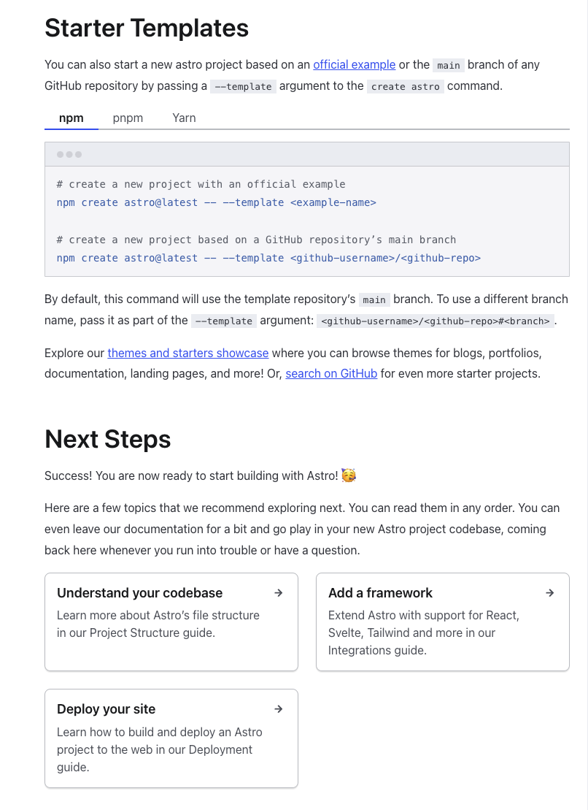

# Ideas on categories &amp; url paths
Categories are a great top-level concept to organize content I want to use `tags` as a mechanism to show related items ala [Astro Doc's] bottom of the page links.

I also like [this type of category page](https://docs.astro.build/en/getting-started/). Might make sense since I want to add a `description` property to each category and possibly even an image/icon/logo (small). Actual pages will also have a link image similar to categories. Perhaps even a hero image but that might be overkill and I don't want to figure out that `CSS` within this template

I think my favorite idea now is going to be to have a "multi-site" setup for all my cheatsheets. The sites would be:

| Micro Site           | Contents                                                                                                          | Main Nav                                                                                                                                                                 |
| -------------------- | ----------------------------------------------------------------------------------------------------------------- | ------------------------------------------------------------------------------------------------------------------------------------------------------------------------ |
| Languages            | Language specific cheats                                                                                          | <ul><li>JavaScript</li><li>TypeScript</li><li>Java (🤮)</li><li>SQL</li></ul>                                                                                             |
| System               | System management and useful snippets                                                                             | <ul><li>Bash</li><li>Mac</li><li>Docker</li><li>VSCode</li><li>Chrome</li></ul>                                                                                          |
| Full Stack           | Web techs, frameworks, libraries                                                                                  | <ul><li>Authentication</li><li>Frameworks</li><li>Node Libraries</li><li>Serverless Architecture</li><li>Version Control</li><li>Web Techs</li><li>Data Stores</li></ul> |
| Computer Science     | Computer science reference &amp; extras                                                                               | <ul><li>Functional Programming</li><li>Data Structures</li><li>System Design</li><li>Philosophies</li><li>Patterns</li><li>Anti Patterns</li></ul>                       |
| Starters &amp; Templates | File downloads of starters and templates so I don't need to always remake them cuz that's annoying as all get out | <ul><li>TypeScript Starter</li><li>HTML template</li><li>Rollup Starter</li><li>Webpack Starter</li><li>Docker Starter</li></ul>                                         |
| Platforms &amp; DevOps   |                                                                                                                   | <ul><li>Ansible</li><li>AWS</li><li>Datadog</li><li>Deployment</li><li>Deployments &amp; Hosting</li><li>Docker </li><li>Github</li><li>Kafka</li><li>Splunk</li></ul>       |
| Misc                 | Makes sense to merge this with Starters &amp; Templates site but i'll see when I get to there.                        | <ul><li>Performance Optimization Techniques</li></ul>                                                                                                                    |

### Links
- Multisite links
  - https://github.com/11ty/eleventy/discussions/2259
  - https://github.com/nc7s/eleventy-multisite
  - https://github.com/pdehaan/11ty-multisite
- https://roadmap.sh/
  - https://roadmap.sh/backend
- https://sentry.io/answers/show-the-current-branch-name-in-git/
- https://stackoverflow.com/questions/6245570/how-do-i-get-the-current-branch-name-in-git

### Languages
- JavaScript
  - Array
  - Asynchronous Programming
  - CSS
  - Date Time
  - DOM
  - Files
  - Function
  - Math
  - Number
  - Object
  - Random
  - Recursion
  - Reduce
  - String
  - Validator
  - Misc
- TypeScript
  - Typing
  - Common issues
  - tsconfig.json
  - Single file Bundling
- Java (🤮)
  - God no, please no.

### System
- Bash
  - Commands
  - Dotfiles
  - Installs
- Mac
- Docker
- VSCode
  - Plugins
  - Settings
- Chrome

### Full Stack
- Web Techs
  - HTML
  - CSS
  - REST
  - XML (🤮)
  - Websockets
  - Accessibility
  - Progressive Web Apps
    - PWA Concepts
    - Offline Capabilities and Push Notifications
- Node Libraries
  - Jest
  - 11ty
  - heap-ts
  - fp-ts
  - nvm
  - express
  - React
  - Redux &amp; Sagas
  - Angular (🤮)
- Frameworks
  - Next.js
  - Mine lol
- Authentication
  - JWTs
- Version Control
- Serverless Architecture
  - Serverless Concepts
  - Serverless Other
-Data Stores
  - PostgreSQL
    - Anti Patterns
      - [Presentations](https://www.slideshare.net/billkarwin)
      - [Sql Antipatterns Strike Back](https://www.slideshare.net/billkarwin/sql-antipatterns-strike-back)
  - Mongo
  - Redis

### Computer Science
All these will be 1 page of links

- Functional Programming
- Data Structures
- System Design
- Philosophies
- Patterns
- Anti Patterns

### Starters &amp; Templates
- TypeScript Starter
- HTML template
- Rollup Starter
- Webpack Starter
- Docker Starter

### Platforms &amp; DevOps
- Deployments &amp; Hosting
  - Heroku
  - Netlify
  - AWS
- Github
  - Actions
- AWS
  - Teraform
- Splunk
- Datadog
- Docker 
- Ansible
- Kafka
  - CQRS
  - Event driven Architecture
- Deployment

### Misc &amp; To Organize
Misc &amp; to be organized stuff

- Yaml
- Performance Optimization Techniques

