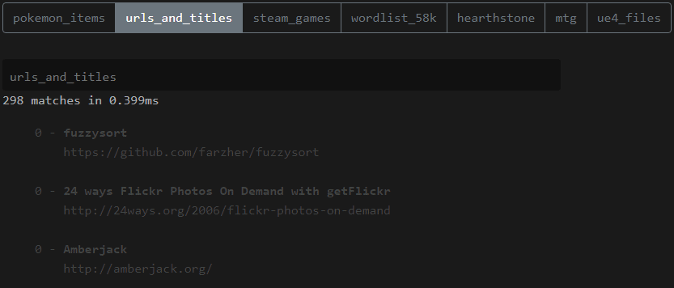

## Purpose
I want to change the way that I handle the snippets on my [cheatsheets](https://tech.libresinn.com/cheatsheets/) website. I want a more deeply nested structure to better organize my snippets.

## Thoughts
I think I might need to maintain a secondary script to manage a category path using `11ty.on('after')` or as a standalone script. I'll ask in Discord if there is a way to do this with the platform natively. If I have to maintain a separate JSON file I think I may handle it.

Lastly I need to make that this output will work produce an object that my fuzzy logic can understand and therefore search. 

After this I want to update this branch of 11ty to the newest version so I can use `import` and `export` statements.

Finally I need to rebuild the main and sub-pages to show them on-screen.

### So far
So far I've been able to generate an object where the folder directory is the key. I recursively walk the directory tree to get all the breadcrumbs. The output looks like:
```json
{
  "contents/browser": { "label": "Browser" },
  "contents/browser/css": { "label": "CSS" },
  "contents/sql": { "label": "SQL" },
  "contents/subsystem": { "label": "Sub System" },
  "contents/subsystem/bash": { "label": "Bash" },
  "contents/subsystem/test1": { "label": "Test 1" },
  "contents/subsystem/test1/test2": { "label": "Test 2" },
  "contents/subsystem/test1/test2/test3": { "label": "Test 3" }
}
```

This is helpful when it comes to building the breadcrumbs for a snippet. What I still need to do is create a category & content tree to build the pages which means this object isn't what I need to build category pages. I need to build this tree in the `addCollections` function. I do not believe it would make sense to build this outside of `11ty` as a standalone script. Tho, I could save it to the data directory like I plan to do with breadcrumbs.

## Requirements
- Deeply nested folder structure
- Breadcrumbs for every snippet
  - All categories will have a display name
- Folders are categories and should have metadata associated with it
  - Name
  - Description
  - Images (header, icon etc)
  - Related
- Related content
  - Automatic or frontmatter config
- Notifications for
  - Empthy paths
- Empthy directories should display the configured content for that category
- Automatic keyword extraction
- Fuzzy search to find category & snippets
  - Search by category or snippets (2 objects or all together?)
  - Results
    - Show breadcrumbs.
      - Each item should link to it's parent category page
    - Show category or snippet text teaser in results 
    - Show sample related. limit to 3, linkable
    - Links to page

## Development
### Concerns
My current biggest concern is how to maintain the breadcrumbs (parent tree) in the `addCollection` function. That needs to be maintained for all.

I think the best option will be to make it a data file: `./config/11ty/data/categories.(json|yaml)`. I can use the `eleventyConfig.on('eleventy.after', event.after)` to save the categories that I generated in the `eleventyConfig.addCollection('categories')` function (both cat list & breadcrumbs). This proposal would allow me to leverage `11ty` to it's fullest.

### UI Output


```txt
maro
--------------------------------
20 matches in 2.4ms

- Super Mario 1
  - Games > Nintendo > SNES 
  - Lorem ipsum dolor sit amet, consectetur adipiscing elit.
  - Related: tag 1, tag 2, tag 3
- Super Mario 
  - Games > Nintendo > SNES
  - Lorem ipsum dolor sit amet, consectetur adipiscing elit.
  - Related: tag 1, tag 2, tag 3
- Mario Kart
  - Games > Nintendo > Switch > Super Mario 3
  - Lorem ipsum dolor sit amet, consectetur adipiscing elit.
  - Related: tag 1, tag 2, tag 3
- Mario Party 3
  - Games > Nintendo > WII > Super Mario 3
  - Lorem ipsum dolor sit amet, consectetur adipiscing elit.
  - Related: tag 1, tag 2, tag 3

(... further results)
```

### Data Structure
Still not sure yet.

```js
const snippet = {
  // To the category or snippet
  url: '/some/url'
  title: 'Snippet Title',
  teaser: '',

  // These should be in order. These are the categories
  breadcrumbs: [{ label: '', url: '', snippet: '', image: '' }],
  related: [{ tag: '', url: '' }],
}

const snippets = [snippet, snippet, snippet, ...]
```

## Links
<!-- I don't actually need these since I will be using a [fuzzy search library instead](./docs/fuzzy-search.md) -->

- [TreeView with Search Bar](https://js.devexpress.com/jQuery/Demos/WidgetsGallery/Demo/TreeView/TreeViewWithSearchBar/MaterialBlueLight/)
- [Searching TreeViews](https://developer.mescius.com/wijmo/demos/Nav/TreeView/Searching/purejs)
- [TreeView with Search Bar](https://codepen.io/husin/pen/MPEjMK)
- [Yn96ju (forked) - StackBlitz](https://stackblitz.com/run?file=index.js)
- [package.json — nodebox — CodeSandbox](https://codesandbox.io/p/sandbox/mystifying-brown-bleztc?file=%2Fpackage.json)
- [Demo - Searching TreeViews - JSFiddle - Code Playground](https://jsfiddle.net/Wijmo5/ff81c4u0/)
- [index.js — nodebox — CodeSandbox](https://codesandbox.io/p/sandbox/modified-tree-final-forked-op1x0k?file=%2Fsrc%2Findex.js%3A10%2C29)
- [Create Searchable nested TreeView in Vanilla Javascript - YouTube](https://www.youtube.com/watch?v=-T_oryzmD40)
- [front-end-components/tree-view/src/v3\_search at main · StepanNaryshkov/front-end-components](https://github.com/StepanNaryshkov/front-end-components/tree/main/tree-view/src/v3_search)
- [javascript - How to find search path of node in tree js/ts - Stack Overflow](https://stackoverflow.com/questions/56950600/how-to-find-search-path-of-node-in-tree-js-ts)
- [How to Find a Path Through a Tree With JavaScript - James H. Edwards](https://incrediblesound.github.io/blog/2014/07/27/how-to-find-a-path-through-a-tree-with-javascript/)
- [javascript - How to get A Path from a nested object tree - Stack Overflow](https://stackoverflow.com/questions/70635605/how-to-get-a-path-from-a-nested-object-tree)
- [javascript - List all possible paths using lodash - Stack Overflow](https://stackoverflow.com/questions/36128171/list-all-possible-paths-using-lodash)
- [Find path in a JS object? My favorite question to ask in a Frontend interview. | by Srijan Gulati | Medium](https://srijansinghgulati.medium.com/find-path-in-a-js-object-my-favorite-question-to-ask-in-a-frontend-interview-faab189e2c19)
- [javascript - Get array of all Lodash paths of object - Stack Overflow](https://stackoverflow.com/questions/55700754/get-array-of-all-lodash-paths-of-object)
- [Find a full object path to a given value with JavaScript - Stack Overflow](https://stackoverflow.com/questions/53543303/find-a-full-object-path-to-a-given-value-with-javascript)
- [find-object-paths - npm](https://www.npmjs.com/package/find-object-paths)
- ⭐️ [Find all paths of value in a JavaScript object](https://lowrey.me/find-all-paths-of-value-in-a-javascript-object/)
- [JavaScript Find Path of Key in Deeply Nested Object or Array - TecHighness](https://www.techighness.com/post/javascript-find-key-path-in-deeply-nested-object-or-array/)
