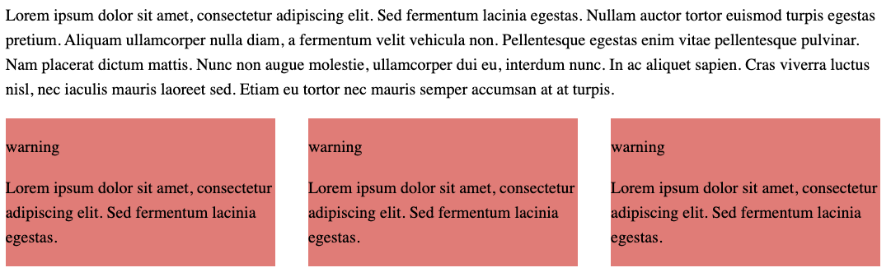

# Enhancements

- [Website](#website)
- [Collections](#collections)
  - [Teasers / Summaries](#teasers--summaries)
- [Markdown](#markdown)
  - [Carousels](#carousels)
    - [Example](#example)
  - [Enhanced Lists](#enhanced-lists)
    - [Example](#example-1)
- [Optional](#optional)
- [Branches](#branches)
  - [Feature](#feature)
  - [Refactors](#refactors)

## Website
- Make the copyright date in the footer use a variable
  - Use global variable
    - `const copyrightDate = /\d{4}/.exec(Date())[0]`
- Fix favicon
- Fix the header in `base.vto` since I don't have the `metadata` variable available
- Both blog & examples need to have a related section at the bottom
  - [Tags page](https://eleventy-notes.sandroroth.com/tags/)
  - [Callouts](https://eleventy-notes.sandroroth.com/n/writing/callouts/)
  - [Queries](https://eleventy-notes.sandroroth.com/n/writing/dynamic-content/queries/)
- Pages
  - `/changelog` page
    - Should automatically update
  - Create a page that pulls in this projects `README`
    - Could go best under `/changelog`
  - Built With

## Collections
### Teasers / Summaries
I want to be able to manually set teaser content for content. Preferably add them to front matter if the key doesn't exist & save the file.
- [`text-summary`](https://www.npmjs.com/package/text-summary)
- [`node-summarizer`](https://www.npmjs.com/package/node-summarizer)
- [`jbrooksuk/node-summary`](https://github.com/jbrooksuk/node-summary)
- [`matt-schwartz/text-summarization`](https://github.com/matt-schwartz/text-summarization)

## Markdown
### Carousels
I want to write a plugin for `markdown-it` that can create carousels.

#### Example
**`Markdown`**
```md
::::: cols
  :::: warning
  Lorem ipsum dolor sit amet, consectetur adipiscing elit. Sed fermentum lacinia egestas.
  ::::

  :::: warning
  Lorem ipsum dolor sit amet, consectetur adipiscing elit. Sed fermentum lacinia egestas.
  ::::

  :::: warning
  Lorem ipsum dolor sit amet, consectetur adipiscing elit. Sed fermentum lacinia egestas.
  ::::
:::::
```

**Output**


### Enhanced Lists


#### Example
**`Markdown`**
```md
- asdasd \
  Lorem ipsum dolor sit amet, consectetur ... \
  
  <!-- Other markdown or html -->
- asdasd
- asdasd
```

**HTML Output**
```html
<ol>
  <li><p>Lorem ipsum dolor sit amet, consectetur adipiscing elit. Sed fermentum lacinia egestas. Nullam</p></li>

  <li>
    <p>Lorem ipsum dolor sit amet, consectetur adipiscing elit. Sed fermentum lacinia egestas. Nullam</p>
    <pre>
      <code class="lang-js">
        // Some code goes in here
      </code>
    </pre>
  </li>

  <li>
    <p>Lorem ipsum dolor sit amet, consectetur adipiscing elit. Sed fermentum lacinia egestas. Nullam</p>
    <pre>
      <code class="lang-js">
        // Some code goes in here
      </code>
    </pre>
  </li>
</ol>
```

## Optional
- Icon functionality set in `frontmatter`
- Description for landing pages in frontmatter
- Create new directory called `website`/`site`/`public`
  - Images folder
  - `assets` & `styles` folders
- Figure out a better way to add the `path` variable to my client side JS
- Layout aliases
  - [Layout Aliasing](https://www.11ty.dev/docs/layouts/#layout-aliasing)

## Branches
### Feature
- `feature/hotwire`
  - I may want to extend the `markdown-it` code blocks so they can handle this enhancement
- `feature/theme` or `feature/vento`
- `feature/mdit-plugins`
  - [`MarkdownIt`](https://mdit-plugins.github.io/)
- `feature/eleventy-img`
- `feature/schema`
  - [`quasibit/eleventy-plugin-schema`](https://github.com/quasibit/eleventy-plugin-schema?tab=readme-ov-file)
- `feature/rename`
  - I want to rename files since so many of them do not make sense
  - I want to rename a bunch of functions to make them more concise
- `feature/linting`
  - Add `eslint` and `prettier`
- `feature/grouping`
  - After `feature/hotwire`
  - Clicking on a group link should show titles and snippet content all on one page
    - via`hotwire`
  - This

### Refactors
- `feature/refactor-content`
  - Do this after hotwire since a lot will change here
  - Much of the content is not using headings and such
  - Fix titles since they will be grouped many of the titles should change to accommodate that
  - I want all snippets to follow my preferred formatting rules
  - Add descriptions to all categories
- `feature/refactor-typings`
- `feature/refactor-todos`
  - [`azat-io/todoctor`](https://github.com/azat-io/todoctor)
  - A better and nicer looking todo reporter. Example command: `todoctor -o .reports`
- `feature/refactor-build`
  - In order to build and push to my website I need to change parameters in configs before I push to `main`
