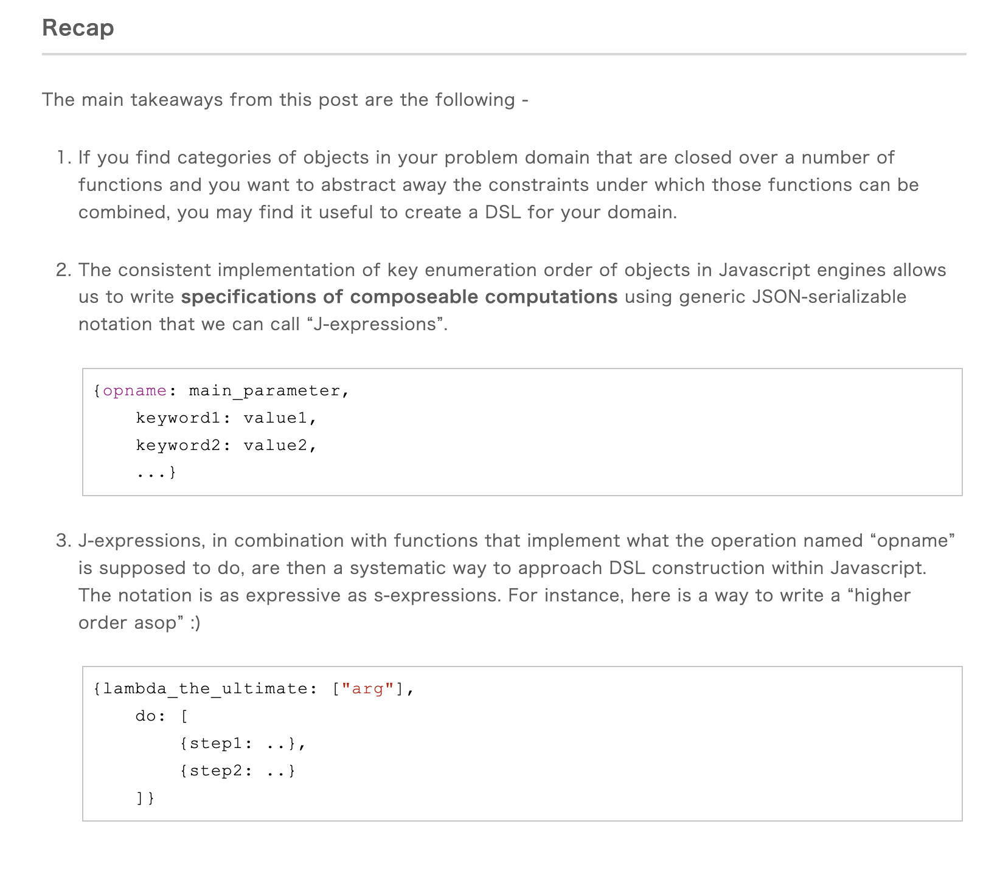

# Enhancements

## Website
- Fix favicon
- Fix the header in `base.vto` since I don't have the `metadata` variable available
- Both blog & examples need to have a related section at the bottom
  - [Tags page](https://eleventy-notes.sandroroth.com/tags/)
  - [Callouts](https://eleventy-notes.sandroroth.com/n/writing/callouts/)
  - [Queries](https://eleventy-notes.sandroroth.com/n/writing/dynamic-content/queries/)
- Pages
  - `/changelog` page
    - Should automatically update
  - Create a page that pulls in this projects `README`
    - Could go best under `/changelog`
  - Built With

## Images
I want to have the images co-located with their content files but when building all those images & assets should be moved to `/assets/{page}/directory/{image_guid}.{ext}`
- [Colocate images with your post using Eleventy](https://scottwhittaker.net/colocate-images-with-post-using-eleventy)
- [Using the Eleventy Image plugin without a central image folder / Graham F. Scott](https://gfscott.com/blog/eleventy-img-without-central-image-directory/)
- [solution-loisir/markdown-it-eleventy-img: A markdown-it plugin that processes images through the eleventy-img plugin. Can be used in any projects that use markdown-it.](https://github.com/solution-loisir/markdown-it-eleventy-img)

I want to take this plugin and pull it into my repo instead.

```md
{# This is a co-located image #}

```

```json
{
  "markdown-it-eleventy-img": "^0.10.2",
}
```

```ts
import markdownIt from 'markdown-it'
import path from 'path'
import markdownItEleventyImg from 'markdown-it-eleventy-img'

export default markdownIt({
  html: true,
  linkify: true
})
  .use(markdownItEleventyImg, {
    imgOptions: {
      widths: [1000, 800, 600],
      urlPath: '/assets/imgs/',
      outputDir: 'cheatsheets/assets/imgs',
      // formats: ['avif', 'webp', 'jpeg'],
    },
    globalAttributes: {
      class: 'markdown-image',
      decoding: 'async',
      sizes: '100vw', // If you use multiple widths don't forget to add a `sizes` attribute
    },

    // Literally from the example. I don't get it.
    resolvePath: (filepath, env) => path.join(path.dirname(env.page.inputPath), filepath)
  })
```

## Optional
- Icon functionality set in `frontmatter`
- Description for landing pages in frontmatter
- Create new directory called `website`/`site`/`public`
  - Images folder
  - `assets` & `styles` folders

## Teaser Summaries
I want to be able to manually set teaser content for content. Preferably add them to front matter if the key doesn't exist & save the file.
- [`text-summary`](https://www.npmjs.com/package/text-summary)
- [`node-summarizer`](https://www.npmjs.com/package/node-summarizer)
- [`jbrooksuk/node-summary`](https://github.com/jbrooksuk/node-summary)
- [`matt-schwartz/text-summarization`](https://github.com/matt-schwartz/text-summarization)

## Enhanced Lists


**Example Output**
```html
<ol>
  <li><p>Lorem ipsum dolor sit amet, consectetur adipiscing elit. Sed fermentum lacinia egestas. Nullam</p></li>

  <li>
    <p>Lorem ipsum dolor sit amet, consectetur adipiscing elit. Sed fermentum lacinia egestas. Nullam</p>
    <pre>
      <code class="lang-js">
        // Some code goes in here
      </code>
    </pre>
  </li>

  <li>
    <p>Lorem ipsum dolor sit amet, consectetur adipiscing elit. Sed fermentum lacinia egestas. Nullam</p>
    <pre>
      <code class="lang-js">
        // Some code goes in here
      </code>
    </pre>
  </li>
</ol>
```

## Branches
### Feature
- `feature/hotwire`
  - I may want to extend the `markdown-it` code blocks so they can handle this enhancement
- `feature/theme` or `feature/vento`
- `feature/mdit-plugins`
  - [`MarkdownIt`](https://mdit-plugins.github.io/)
- `feature/eleventy-img`
- `feature/schema`
  - [`quasibit/eleventy-plugin-schema`](https://github.com/quasibit/eleventy-plugin-schema?tab=readme-ov-file)
- `feature/rename`
  - I want to rename files since so many of them do not make sense
  - I want to rename a bunch of functions to make them more concise
- `feature/linting`
  - Add `eslint` and `prettier`
- `feature/grouping`
  - After `feature/hotwire`
  - Clicking on a group link should show titles and snippet content all on one page
    - via`hotwire`
  - This

### Refactors
- `feature/refactor-content`
  - Do this after hotwire since a lot will change here
  - Much of the content is not using headings and such
  - Fix titles since they will be grouped many of the titles should change to accommodate that
  - I want all snippets to follow my preferred formatting rules
  - Add descriptions to all categories
- `feature/refactor-typings`
- `feature/refactor-todos`
  - [`azat-io/todoctor`](https://github.com/azat-io/todoctor)
  - A better and nicer looking todo reporter. Example command: `todoctor -o .reports`
- `feature/refactor-build`
  - In order to build and push to my website I need to change parameters in configs before I push to `main`
