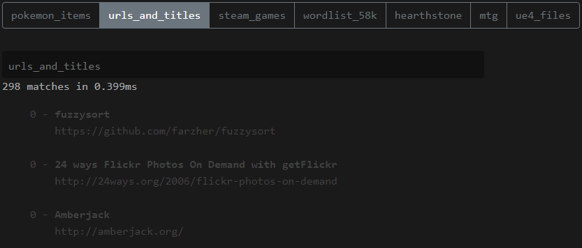

# Fuzzy Search Thoughts
1. I want to make sure the data structure will work with the fuzzy search.
2. I don't know if I want a dropdown search or to filter the entire page.
   1. I am not sure this is the option I want to take cuz i'll need to load all the snippets.
   2. That may be fine since the categories file will contain all snippets as a `JSON` file which i'll server via the browser.

```js
const snippet = {
  // I think these are self explanatory.
  path: '/some/url'
  title: 'Snippet Title',
  teaser: '',
  image: '',

  // In order, not sure if this should be an object or a plain string
  // Will this be clickable?
  breadcrumbs: [{ label: '', url: '' }],
  
  related: [{ tag: '', url: '' }],
}

// For the fuzzy search
const categories = [snippet, snippet, snippet]
```

### UI Output


```txt
maro
--------------------------------
20 matches in 2.4ms

- Super Mario 1
  - Games > Nintendo > SNES 
  - Lorem ipsum dolor sit amet, consectetur adipiscing elit.
  - Related: tag 1, tag 2, tag 3
- Super Mario 
  - Games > Nintendo > SNES
  - Lorem ipsum dolor sit amet, consectetur adipiscing elit.
  - Related: tag 1, tag 2, tag 3
- Mario Kart
  - Games > Nintendo > Switch > Super Mario 3
  - Lorem ipsum dolor sit amet, consectetur adipiscing elit.
  - Related: tag 1, tag 2, tag 3
- Mario Party 3
  - Games > Nintendo > WII > Super Mario 3
  - Lorem ipsum dolor sit amet, consectetur adipiscing elit.
  - Related: tag 1, tag 2, tag 3

(... further results)
```

## Links
- [leeoniya/uFuzzy: A tiny, efficient fuzzy search that doesn't suck](https://github.com/leeoniya/uFuzzy)
- [Nozbe/microfuzz: A tiny, simple, fast JS fuzzy search library](https://github.com/Nozbe/microfuzz)
- [Live Demo | Fuse.js](https://www.fusejs.io/demo.html)
- [QuickScore | A JavaScript string-scoring and fuzzy-matching library based on the Quicksilver algorithm](https://fwextensions.github.io/quick-score-demo/#demo)
- [farzher/fuzzysort: Fast SublimeText-like fuzzy search for JavaScript.](https://github.com/farzher/fuzzysort)
